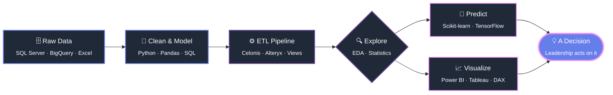

<!-- ==================== ANIMATED HEADER ==================== -->
<div align="center">


<!-- ==================== TYPING ANIMATION ==================== -->
<a href="https://linkedin.com/in/vanshika-kapur">
  
</a>

<br/>

<!-- ==================== SOCIAL BADGES ==================== -->
<a href="https://linkedin.com/in/vanshika-kapur"></a>
<a href="mailto:Vanshikakapur2002@gmail.com"></a>
<a href="https://github.com/vanshikakapur"></a>


</div>

---

<!-- ==================== HIRE ME BANNER ==================== -->
<div align="center">

### 🎯 `OPEN TO WORK` — Data Analyst / Data Scientist / BI Engineer

**Graduating May 2026** &nbsp;•&nbsp; 📍 Cleveland,Ohio (open to relocate) &nbsp;•&nbsp; 🇺🇸 Authorized to work in the US


</div>

---

##  &nbsp;About Me

```python
class VanshikaKapur:
    def __init__(self):
        self.role      = "Data Scientist / Analyst"
        self.education = "MS Data Science @ Indiana University Bloomington"
        self.gpa       = 3.9 / 4.0
        self.based_in  = "Bloomington, Indiana, USA"
        self.stack     = ["Python", "SQL", "Power BI", "Tableau", "VBA", "DAX"]
        self.superpower = "Making 31 factories, 5 regions and $560M "\
                          "fit onto one dashboard leaders actually use"

    def currently(self):
        return {
            "learning"  : ["Snowflake", "MLOps", "Cloud Data Warehousing"],
            "building"  : "End-to-end churn prediction + BI workflows",
            "seeking"   : "Full-time Data roles starting May 2026 🚀",
        }

    def say_hi(self):
        print("Let's build something the data actually asked for.")
```

- 🎓 **MS in Data Science** at Indiana University Bloomington — **3.9/4.0**, graduating **May 2026**
- 💼 Shipped analytics at **Vertiv** (Fortune 500 manufacturing) and **Celonis** (process mining leader)
- 🧑‍🏫 Taught **50+ graduate students** Python, BigQuery & Google Cloud as a **Graduate Associate Instructor**
- 🤖 I like the whole pipeline: **raw SQL → clean model → ML → a dashboard someone makes a decision from**
- ⚡ Fun fact: I once replaced **5+ hours of monthly manual planning** with a VBA macro that runs in seconds

---

##  &nbsp;Impact, By The Numbers

<div align="center">

| 📊 What I Built | ⚙️ Where | 🎯 Measurable Impact |
|:---|:---|:---|
| Automated capacity allocation | Vertiv | **240+ products**, planning time **↓ 90%** |
| Demand vs. capacity BI suite | Vertiv | Steered strategy for **$560M** production volume |
| Manufacturing footprint analysis | Vertiv | **31 factories · 5 regions** → approved expansion |
| ETL pipelines in Celonis + SQL | Celonis | **10,000+ records**, **+75%** pipeline efficiency |
| Root-cause KPI analysis (PQL) | Celonis | **+20%** productivity improvement |
| Drowsiness detection (InceptionV3) | Project | **93%** accuracy on **80K+** images |
| Churn prediction (Random Forest) | Project | **85%** accuracy across **20+** features |

</div>

---

##  &nbsp;Tech Arsenal

<div align="center">

### Languages & Core


### Data · BI · ML
<p>


</p>
<p>


</p>

### Query, Automate & Ship
<p>


</p>

### AI Copilots I Build With
<p>


</p>

</div>

---

##  &nbsp;Experience

<details open>
<summary><b>🎓 Graduate Associate Instructor — Indiana University Bloomington</b> &nbsp;·&nbsp; <i>Aug 2025 – Dec 2025</i></summary>
<br/>

> Taught the class I wish I'd had: real data, real cloud, real dashboards.

- Delivered hands-on instruction to **50+ graduate students** on Python dashboards, **BigQuery** SQL and **Google Cloud** environments
- Assessed **100+ assignments**, coaching students to genuine proficiency in large-scale data analysis

`Python` `SQL` `BigQuery` `Google Cloud` `Data Visualization` `Mentorship`

</details>

<details open>
<summary><b>📈 Data Analyst Intern — Vertiv</b> &nbsp;·&nbsp; Chesterfield, MO &nbsp;·&nbsp; <i>May 2025 – Aug 2025</i></summary>
<br/>

> Supply-chain planning for a global manufacturer — where a spreadsheet error costs millions.

- **Automated** monthly capacity allocation across **240+ products** with **Excel VBA** macros — killed **5+ hours** of manual work per cycle and cut planning time by **90%**
- **Built Power BI dashboards** tracking demand vs. capacity and **SIOP** trends across **10+ product lines** and **5 regions**, enabling data-driven strategy for **$560M** in production volume
- **Analyzed 2024–2027 manufacturing footprint** across **31 factories / 5 regions**, surfacing space-growth and spend trends that drove a **leadership-approved capacity expansion**, presented to a 6-member team

`Power BI` `DAX` `Excel VBA` `SIOP` `Capacity Planning` `Executive Reporting`

</details>

<details open>
<summary><b>⚙️ Data Analyst Intern — Celonis</b> &nbsp;·&nbsp; Indore, India &nbsp;·&nbsp; <i>Jun 2023 – Aug 2023</i></summary>
<br/>

> Process mining: finding the bottleneck the org didn't know it had.

- **Designed & optimized ETL pipelines** in Celonis Studio + SQL to extract, cleanse and transform **10,000+ operational records** across **10+ process variants** → **75% faster** pipeline processing
- **Ran root-cause analysis** on KPI gaps using **PQL**, Conformance and Variant Explorer → a measurable **20% productivity gain**
- **Developed Tableau dashboards** exposing **5+ workflow bottlenecks** across cross-functional systems, handing management decision-ready insights

`ETL` `SQL` `PQL` `Celonis Studio` `Tableau` `Root-Cause Analysis`

</details>

---

##  &nbsp;Featured Projects

<div align="center">

<table>
<tr>
<td width="50%" valign="top">

### 🔮 Customer Churn Analytics & Prediction
`Power BI` · `Python` · `SQL Server` · `Scikit-learn`

**From raw table to "who's about to leave, and why."**

- Architected a churn pipeline in **SQL Server** — **30+ attributes** transformed, nulls resolved across **25+ fields**
- Defined **3+ KPIs** (churn rate & co.) and built views powering **10+ visuals**
- Trained a **Random Forest** on **20+ features** → **85% accuracy**, validated with confusion matrix + classification metrics

 

</td>
<td width="50%" valign="top">

### 😴 Driver's Drowsiness Detection System
`Python` · `OpenCV` · `Keras` · `NumPy`

**Real-time computer vision that could actually save a life.**

- **Led a 4-member team** building live detection with **OpenCV** + **Eye Aspect Ratio (EAR)**
- Hit **40–60 ms inference latency** and **sub-2-second** alert response
- **InceptionV3 transfer learning** on **80K+ images** → **93% accuracy**, tuned with `EarlyStopping` + `ReduceLROnPlateau`

 

</td>
</tr>
<tr>
<td width="50%" valign="top">

### 🛒 Amazon Sales Analysis
`Python` · `TensorFlow` · `Scikit-learn` · `Seaborn` · `Tableau`

**Where pricing meets pattern recognition.**

- Preprocessing, statistical analysis and ML modeling to surface **5 key sales & pricing trends** for targeted marketing
- Deployed **interactive Tableau dashboards** fusing Python-generated insights → strategies lifting potential revenue opportunity by **25%**


</td>
<td width="50%" valign="top">

### 🚧 What's Next
`In Progress`

- 🧊 **Snowflake + dbt** modern data stack playground
- 🤖 **MLOps**: taking the churn model from notebook → served endpoint
- 📚 Writing up my Power BI + DAX patterns as a public toolkit

*⭐ Star the repos — they update as I learn.*

</td>
</tr>
</table>

</div>

---

##  &nbsp;Education

<div align="center">

| 🏛️ Institution | 🎓 Degree | 📅 Timeline | 📊 GPA |
|:---|:---|:---:|:---:|
| **Indiana University Bloomington** <br/> <sub>Bloomington, Indiana, USA</sub> | M.S. Data Science | Aug 2024 – May 2026 | **3.9 / 4.0** |
| **Medi-Caps University** <br/> <sub>Indore, India</sub> | B.Tech Computer Science | Aug 2020 – Mar 2024 | **8.8 / 10.0** |

</div>

**Coursework:** Data Visualization · Advanced Database Concepts · Statistics · Applied Machine Learning · Management Access Using Big Data · Python · OOP · Operating Systems · Data Structures & Algorithms

---

##  &nbsp;What I Write Most

<div align="center">


</div>

<!-- Activity-based widgets are parked below on purpose: they advertise commit
     volume, which isn't where this profile's story is. Uncomment once the
     contribution graph fills in. -->
<!--


-->


---

##  &nbsp;How I Turn Data Into Decisions



> Every project on this profile follows this loop. The last box is the only one that matters.

---

##  &nbsp;Where I'm Deep vs. Where I'm Growing

```text
Python  · Pandas · NumPy   ████████████████████░░░░   Daily driver
SQL     · joins, CTEs, perf ████████████████████░░░░   Daily driver
Power BI · DAX · modeling  ███████████████████░░░░░   Shipped to execs
Tableau · dashboards       ██████████████████░░░░░░   Shipped to mgmt
Excel VBA · automation     ██████████████████░░░░░░   240+ products automated
Scikit-learn · classic ML  ████████████████░░░░░░░░   85–93% acc. in prod projects
TensorFlow · Keras · CV    ██████████████░░░░░░░░░░   InceptionV3, 80K+ images
Google Cloud · BigQuery    █████████████░░░░░░░░░░░   Taught it to 50+ students
Snowflake · dbt            ████████░░░░░░░░░░░░░░░░   Learning now ⚡
MLOps · model serving      ██████░░░░░░░░░░░░░░░░░░   Next on the list ⚡
```

---

##  &nbsp;Let's Talk Data

<div align="center">

**I'm looking for a team where curiosity is a job requirement.**
If you're hiring a Data Analyst, Data Scientist or BI Engineer for 2026 — my inbox is open. ✨

<a href="mailto:Vanshikakapur2002@gmail.com"></a>
<a href="https://linkedin.com/in/vanshika-kapur"></a>
<a href="tel:+14408701960"></a>

<br/><br/>


</div>
